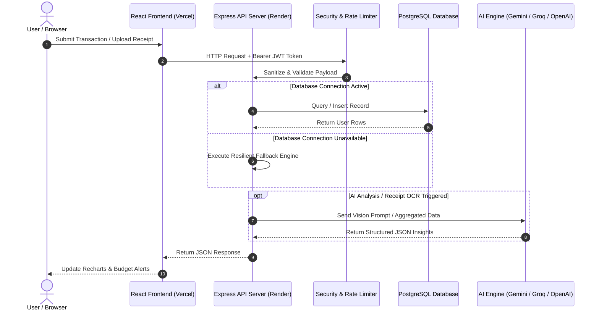

# 🏆 Smart Expense Tracker & AI Pattern Insight Engine

[](https://github.com/MAYANK479/smart-expense-tracker)
[](https://github.com/MAYANK479/smart-expense-tracker)
[](https://reactjs.org/)
[](https://nodejs.org/)
[](https://www.postgresql.org/)
[](https://ai.google.dev/)
[](https://smart-expense-tracker-sable.vercel.app)
[](https://smart-expense-tracker-api-nax2.onrender.com)

An enterprise-grade, full-stack financial management platform designed to solve real-world personal expense tracking with **React 18**, **Express**, **PostgreSQL**, **JWT Authentication**, and **AI Vision OCR**. 

Built with production security standards (`helmet`, `express-rate-limit`, input validation, centralized error handling), automated test coverage with Jest/Supertest, monthly budget target alerts, CSV bank statement bulk importing, and instant AI receipt OCR scanning.

---

## 🌐 Live Production Deployments

* 📱 **Web Application (Vercel)**: [https://smart-expense-tracker-sable.vercel.app](https://smart-expense-tracker-sable.vercel.app)
* ⚡ **Backend REST API (Render)**: [https://smart-expense-tracker-api-nax2.onrender.com](https://smart-expense-tracker-api-nax2.onrender.com)
* 📦 **GitHub Repository**: [https://github.com/MAYANK479/smart-expense-tracker](https://github.com/MAYANK479/smart-expense-tracker)

---

## 🏗️ System Architecture & Data Flow



---

## ⭐ Core Enterprise Features

### 🔐 1. Authentication & Multi-Tenant Data Isolation
- JWT-based authentication (`bcryptjs` password hashing with 10 salt rounds).
- Per-user data partitioning across expenses, budgets, and AI reports.
- Seamless **Guest Mode** fallback allowing instant exploration without upfront sign-up.

### 📷 2. AI Receipt OCR Image Scanner (Standout Feature)
- Drag-and-drop receipt image scanner powered by **Gemini Vision AI** & **Groq Llama 3.3 70B**.
- Automatically extracts merchant name, transaction total amount, category, date, and payment method into the expense form.

### 🎯 3. Monthly Budgets & Overspend Threshold Alerts
- Set monthly budget limits per expense category.
- Real-time progress bars, budget usage percentages, and automated overspend alert banners when reaching 80%+ of category limits.

### 📁 4. CSV Export & Bank Statement Bulk Import
- **CSV Bank Statement Importer**: Parse CSV bank export files, map headers, preview transactions, and bulk upload into database.
- **Report Export**: 1-click download of expense logs formatted as clean `.csv` reports.

### 🛡️ 5. Security & Production Reliability
- **Security Headers**: `helmet` header protection against XSS, clickjacking, and MIME sniffing.
- **Rate Limiting**: `express-rate-limit` protecting AI endpoints against API quota exhaustion (20 req / 15 min) and brute-force mitigation on auth endpoints.
- **Central Error Handler**: Express error middleware preventing leak of internal stack traces in production.

---

## 🧪 Automated Testing Suite

The repository includes a Supertest & Jest integration test suite covering API contracts, authentication workflows, validation constraints, and budget endpoints.

Run the test suite locally:

```bash
npm test
```

### Test Coverage Highlights:
- ✅ `GET /api/health` status check
- ✅ `POST /api/auth/register` user creation & token generation
- ✅ `POST /api/auth/login` password verification & session check
- ✅ `GET /api/auth/me` user profile authentication
- ✅ `GET /api/expenses` dataset listing
- ✅ `POST /api/expenses` valid transaction creation
- ✅ `POST /api/expenses` rejection of invalid/negative amounts (HTTP 400)
- ✅ `POST /api/budgets` budget target limit persistence

---

## 📊 Technical Tradeoffs & Architectural Decisions

| Decision | Choice | Rationale & Tradeoff |
| :--- | :--- | :--- |
| **Authentication** | JWT Tokens in LocalStorage | **Rationale**: Stateless scalability across Vercel & Render. <br>**Tradeoff**: Requires explicit token expiration policies (7 days). |
| **Database Resiliency** | Dual Storage Strategy | **Rationale**: Seamless execution even if PostgreSQL instance is temporarily spinning up on free hosting tiers. <br>**Tradeoff**: Memory store resets on server cold-restarts. |
| **AI LLM Selection** | Multi-Provider Fallback | **Rationale**: Fallbacks across Gemini, Groq (Llama 3.3), OpenAI, and local heuristics prevent downtime during API rate limits. |

---

## 📡 API Endpoints Reference

| Method | Endpoint | Protection | Description |
| :--- | :--- | :--- | :--- |
| `POST` | `/api/auth/register` | Rate Limited | Register user account |
| `POST` | `/api/auth/login` | Rate Limited | Authenticate & retrieve JWT token |
| `GET` | `/api/auth/me` | JWT Required | Get current user profile |
| `GET` | `/api/expenses` | Optional JWT | List user expenses with search/filters |
| `POST` | `/api/expenses` | Optional JWT | Add transaction entry |
| `POST` | `/api/expenses/bulk` | Optional JWT | Bulk import CSV transactions |
| `PUT` | `/api/expenses/:id` | Optional JWT | Edit existing transaction |
| `DELETE` | `/api/expenses/:id` | Optional JWT | Delete transaction |
| `GET` | `/api/budgets` | Optional JWT | Retrieve monthly category budgets |
| `POST` | `/api/budgets` | Optional JWT | Set monthly budget target |
| `POST` | `/api/receipts/scan` | AI Rate Limited | Vision AI receipt image scanner |
| `POST` | `/api/insights/generate` | AI Rate Limited | Trigger AI spending analysis |
| `GET` | `/api/health` | Public | System status healthcheck |

---

## 💻 Local Installation

```bash
# 1. Clone repository
git clone https://github.com/MAYANK479/smart-expense-tracker.git
cd smart-expense-tracker

# 2. Install monorepo dependencies
npm run postinstall

# 3. Run automated tests
npm test

# 4. Start Development Servers
npm run dev:server    # Backend API on http://localhost:5001
npm run dev:client    # Frontend UI on http://localhost:5173
```

---

## 👨‍💻 Author

Designed & Built by **Mayank Pandey** ([MAYANK479](https://github.com/MAYANK479)).
